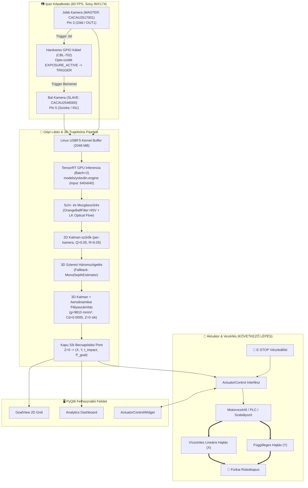
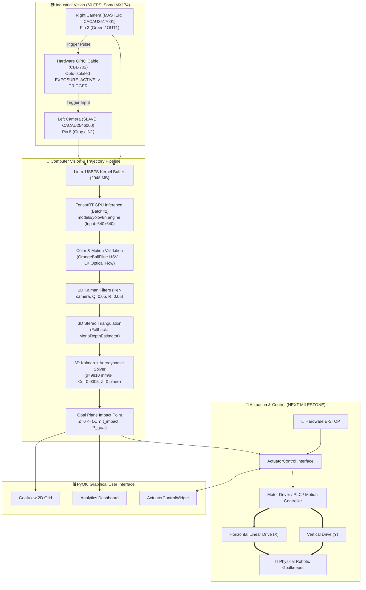

# DEIK Robot Foci Kapus / DEIK Robot Goalkeeper

<div align="center">

[](https://www.python.org/)
[](https://www.riverbankcomputing.com/software/pyqt/)
[](https://pytorch.org/)
[](https://developer.nvidia.com/tensorrt)
[](https://opencv.org/)
[](https://github.com/)
[](https://pytest.org/)
[](https://www.gnu.org/licenses/gpl-3.0)

**Debreceni Egyetem – Informatikai Kar (DEIK)**  
*Ipari sztereó gépi látásra és fizikai trajektória-előrejelzésre épülő valós idejű autonóm robotkapus rendszer*

---

### 🌐 Gyors Navigáció / Language Navigation
[🇭🇺 Magyar Dokumentáció](#-magyar-dokumentáció) • [🇬🇧 English Documentation](#-english-documentation) • [👥 Szerzők / Authors](#-szerzők--authors)

---

</div>

<br/>

# 🇭🇺 Magyar Dokumentáció

## 📌 1. Projektáttekintés

A **DEIK Robot Foci Kapus** egy valós idejű, nagy sebességű optikai labdakövető, 3D trajektória-előrejelző és robotkapus vezérlő rendszer. A berendezés két darab ipari **Ximea MC023CG-SY-UB** sztereó kamerával figyeli a kapu előtti játékteret, és valós időben (aktív konfigurációban **60 FPS**, hardveresen akár 165 FPS képfrissítéssel) számítja ki a kapu síkjában ($Z=0$) a labda várható becsapódási koordinátáit ($X, Y$), a becsapódásig hátralévő időt ($t_{\text{impact}}$) és a lövés kapuba tartásának valószínűségét.

### 🌟 Főbb Rendszerjellemzők:
* **Ipari Kétkamerás Képgyűjtés**: Sony IMX174 Global Shutter szenzorok (2.3 MP, natív 1936 × 1216, aktív vágás: 1816 × 1216, 60 FPS, max. 165 FPS), 20 méteres optikai hibrid USB 3.0 adatátvitel, dedikált Linux kernel `usbfs_memory_mb` pufferkezelés (2048 MB).
* **NVIDIA TensorRT GPU Gyorsítás**: Optimalizált `.engine` modellek (aktív: `models/yolov8n.engine`, támogatott: YOLOv10n, RT-DETR) batch=2 sztereó GPU inferenciával NVIDIA RTX 3050 GPU-n.
* **Robusztus Hibrid Követési Pipeline**:
  * `OrangeBallFilter`: HSV narancssárga szín- és morfológiai szűrő ($H \in [5, 25]$, $S \in [75, 255]$, $V \in [60, 255]$, $\text{min\_orange\_ratio} = 8\%$) dinamikus ROI ablakkal (300×300 px), amely a mintás és feliratos Kipsta 4/5 labdákat is üzembiztosan átengedi.
  * `OpticalFlowTracker`: Lucas-Kanade optikai folyam követés a detektálások közötti mozgásvektorok azonnali frissítésére.
  * `KalmanTracker`: Kameránkénti 2D Kalman-szűrő ($Q=0.05, R=0.05$) a mérési zaj elnyomására.
* **3D Sztereó Háromszögelés & Monokuláris Fallback**: Milliméter pontos 3D térbeli pozíció-meghatározás kalibrációs mátrixokkal (`stereo_calibration.npz`), valamint egykamerás mélységbecslés (`MonoDepthEstimator`), ha a labda az egyik kamerában kitakarásba kerül.
* **Fizika-Alapú Aerodinamikai Pályaszámítás**: 3D spatial Kalman-szűrővel kombinált parabolikus mozgásmodell gravitációval ($g=9810 \text{ mm/s}^2$) és aerodinamikai légellenállással ($C_d = 0.0005$, gömb forma $C_d=0.47$).
* **Lövésdetektáló Logika (`shot_detection`)**: Kinematikai kapu felé tartó mozgásfigyelés ($Z \in [5000, 12000]\text{ mm}$ indítási zóna, $\min 1000\text{ mm}$ elmozdulás, $\min 4\text{ m/s}$ sebesség).
* **PyQt6 Teljes Grafikus Vezérlőpult**:
  * Élő dual kamera feed valós idejű SVG HUD réteggel (detektálási dobozok, középpontok, 3D koordináták, FPS számlálók).
  * **GoalView Widget**: Kapu 2D vetület valós idejű becsapódási pontokkal, konfidencia-zónákkal és lövési előzményekkel.
  * **ActuatorControlWidget**: Hardveres szervo/motor tesztelő és vezérlő panel manuális felülbírálással, preset pozíciókkal és azonnali **E-STOP (vészleállító)** funkcióval.
  * **AnalyticsView Dashboard**: Valós idejű grafikonok (sebesség, magasság, Z-mélység), 2D lövési hőtérkép (Heatmap), szektoros statisztika és CSV/HTML jelentés exportálás.
  * **CalibrationDialog**: Interaktív ChArUco táblás sztereó kalibrációs varázsló élő sarokdetektálással.

---

## 🎯 2. Jelenlegi Státusz & Következő Mérföldkő: Fizikai Aktuátor Bekötése

> [!IMPORTANT]
> ### ⚡ AKTUÁLIS FEJLESZTÉSI FÁZIS: A FIZIKAI AKTUÁTOR BEKÖTÉSE
> **A rendszer teljes szoftveres, gépi látási és irányítási pipeline-ja maradéktalanul elkészült és tesztelt.**
> 
> A kamerakezelés (stabil 60 FPS), a TensorRT AI inferencia, a 3D sztereó háromszögelés, az aerodinamikai trajektória-előrejelzés és a komplett PyQt6 operátori felület (az `ActuatorControlWidget` manuális tesztelővel és az E-STOP vészleállító logikával) **100%-osan üzemkész**.
> 
> A fejlesztés közvetlen, soron következő mérföldköve:
> 1. **A fizikai kapusmechanizmus és aktuátorok (szervomotorok / lineáris és függőleges hajtások) mechanikai és villamos bekötése.**
> 2. **A motorvezérlő elektronika (PLC / mikrokontroller / hajtásszabályozó) hardveres illesztése** a számítógéphez (CAN busz, Modbus, RS-485 vagy USB/Soros kapcsolaton keresztül).
> 3. **A szoftveres vezérlőjelek összekapcsolása a fizikai hajtással**: a kapu síkjában kiszámított ($X, Y$) célpozíciók valós idejű mozgásparancsokká alakítása és a fizikai reakcióidő finomhangolása.
> 4. **A hardveres E-STOP (vészleállító) áramkör éles biztonsági tesztelése** a mozgó mechanikán.

---

## 📐 3. Rendszerarchitektúra & Folyamatábra



---

## 🛠 4. Aktív Hardver és Geometriai Specifikációk

Az alábbi paraméterek a [`config/config.yaml`](file:///home/student/Dokumentumok/DEIK-ROBOTGOALKEEPER-PROJECT-2026/config/config.yaml) fájlban aktívan konfigurált értékeket tükrözik:

| Paraméter / Rendszerelem | Aktív Konfiguráció & Specifikáció | Rendszer Érték / Megjegyzés |
|---|---|---|
| **Kamerák** | **2× Ximea MC023CG-SY-UB** (USB 3.0) | Ipari Global Shutter gépilátás-kamera |
| **Képérzékelő Szenzor** | **Sony IMX174**, 2.3 Megapixel | Pixelméret: **5.86 µm**, Szenzorméret: 11.345 × 7.127 mm |
| **Képfelbontás** | **1816 × 1216 pixel** | Natív szenzor: 1936 × 1216 |
| **Képkockaszám (FPS)** | **60 FPS** (cél / beállított érték) | Hardveres maximum: **165 FPS** |
| **Expozíciós Idő** | **3000 µs (3.0 ms)** | Erősítés (Gain): **0.0 dB** |
| **Optika / Lencse** | **2× Fujifilm CF8ZA-1S** | $f = 8.0\text{ mm}$, C-Mount, $f_{px} \approx 1365.2\text{ px}$ |
| **Kamera Pozíciók (X)** | Bal: $X = -1050\text{ mm}$, Jobb: $X = +1050\text{ mm}$ | Kapu közepéhez képest szimmetrikusan |
| **Kamerák Magassága (Y)** | **2700.0 mm** | Talajszint feletti magasság |
| **Kamerák Z-Offsetje** | **-1200.0 mm** | A gólvonal ($Z=0$) mögött 1.2 méterrel |
| **Kamera Dőlésszög (Pitch)**| **29° lefelé döntve** | Lefedi a gólvonal és a 10m-es lövőzóna közötti teret |
| **Baseline (Kameratáv)** | **2200.0 mm** *(tartalék)* / **~2369.4 mm** *(kalibrált)* | `stereo_calibration.npz` alapján |
| **Hardveres Szinkronizáció**| **Master-Slave GPIO (CBL-702 kábel)** | Jobb kamera MASTER (`CACAU2517001`), Bal SLAVE (`CACAU2546000`) |
| **Szinkronizáció Módja** | **XI_GPO_EXPOSURE_ACTIVE $\rightarrow$ XI_GPI_TRIGGER** | Master Pin 3 (Zöld) $\rightarrow$ Slave Pin 5 (Szürke) |
| **AI Detektor Modell** | **`models/yolov8n.engine`** (TensorRT FP16) | Bemeneti méret: 640×640, Osztály: 32 (*sports ball*) |
| **Detektálási Küszöb** | Konfidencia: **0.15**, IoU: **0.45** | Érzékeny beállítás a repülő labda korai észlelésére |
| **Labda Specifikáció** | **Kipsta 4-es narancssárga focilabda** | Átmérő: **210 mm**, Tömeg: **340 g**, $C_d = 0.47$ |
| **Szín- és Alakszűrés** | HSV: $H \in [5, 25], S \in [75, 255], V \in [60, 255]$ | Min. narancs arány: **8%**, Dinamikus ROI: 300×300 px |
| **Kapu Mérete** | **4000 mm × 2000 mm** (Szélesség × Magasság) | $X \in [-2000, +2000]\text{ mm}$, $Y \in [0, 2000]\text{ mm}$ |
| **Kapu Tűrés (Margin)** | **150.0 mm** | Kereten kívülre eső labdaközéppontok toleranciája |
| **Lövőtávolság** | **10000 mm (10 méter)** | Büntetőpont távolsága a kapu síkjától |
| **ChArUco Kalibrációs Tábla**| **12×9 mezős ChArUco tábla (A1 méret)** | Négyzet: **65 mm**, ArUco marker: **50 mm**, `DICT_6X6_250` |

---

## 📂 5. Rendszerezett Projekt Struktúra

A projekt a tiszta architektúra és a professzionális Python fejlesztési szabványok (PEP 517/518/621) szerint van felépítve:

```
DEIK-ROBOTGOALKEEPER-PROJECT-2026/
├── pyproject.toml                     ← PEP 517/518/621 projekt konfiguráció és metaadatok
├── pytest.ini                         ← Pytest futtató konfiguráció (pythonpath = src)
├── requirements.txt                   ← Python függőségek listája
├── setup.sh                           ← Automatikus környezeti telepítő szkript
├── run.sh                             ← Fő rendszerindító szkript (USBFS ellenőrzéssel)
├── launch_desktop.sh                  ← Asztali parancsikon indító szkript
├── DEIK-Robot-Kapus.spec              ← PyInstaller építési specifikáció
├── LICENSE                            ← GPLv3 licenc fájl
├── README.md                          ← Rendszer dokumentáció (Ez a fájl)
├── config/
│   ├── config.yaml                    ← Fő rendszerkonfiguráció ⚙️
│   └── gui_settings.json              ← Helyi felületi állapotmentések
├── src/                               ← Forráskód könyvtár (tiszta Python modulok)
│   ├── main.py                        ← Fő belépési pont (GUI, Mock és Headless módok) 🚀
│   ├── camera/                        ← Kamera alrendszer (Ximea xiAPI és Mock)
│   │   ├── base_camera.py             ← Absztrakt kamera interfész
│   │   ├── ximea_camera.py            ← Ximea xiAPI wrapper, sávszélesség & GPIO szinkron
│   │   ├── mock_camera.py             ← Webcam / szintetikus videó teszt kamera
│   │   ├── camera_manager.py          ← Kétkamerás koordinátor és frame szinkronizáció
│   │   └── camera_utils.py            ← Linux USBFS memóriakezelő segédfüggvények
│   ├── detection/                     ← Gépi látás és detektálás
│   │   ├── ball_detector.py           ← TensorRT GPU detektor + OrangeBallFilter
│   │   ├── kalman_tracker.py          ← 2D Kalman-szűrő (kameránkénti követés)
│   │   └── optical_flow_tracker.py    ← Lucas-Kanade optikai folyam követő
│   ├── stereo/                        ← 3D Sztereó látórendszer
│   │   ├── triangulator.py            ← 3D sztereó háromszögelő modul
│   │   └── mono_depth_estimator.py    ← Monokuláris mélységbecslő fallback modul
│   ├── calibration/                   ← Kalibrációs segédeszközök
│   │   └── alignment_helper.py        ← Sakktábla/ChArUco pozíció- és dőlésszög-igazító
│   ├── prediction/                    ← Pályaszámítás és fizika
│   │   └── trajectory_predictor.py    ← 3D Kalman + aerodinamikai fizikai mozgásmodell
│   ├── session/                       ← Munkamenet és lövésnaplózás
│   │   └── session_manager.py         ← Lövések és mérések JSONL mentése
│   └── gui/                           ← PyQt6 Grafikus Felhasználói Felület
│       ├── main_window.py             ← Főablak, vezérlési logika és élő HUD
│       ├── goal_view.py               ← Kapu 2D sík vizualizáció és becsapódási pontok
│       ├── actuator_widget.py         ← Aktuátor szervo tesztelő & E-STOP panel
│       ├── analytics_view.py          ← Grafikonok, 2D hőtérkép és CSV/HTML export
│       ├── calibration_dialog.py      ← Interaktív sztereó kalibrációs varázsló
│       ├── splash_screen.py           ← Indítási hardver diagnosztikai ellenőrzés
│       └── theme.py                   ← Sötét / Világos témakezelő
├── tools/                             ← Hardveres és GPIO diagnosztikai eszközök 🛠️
│   ├── README.md                      ← Diagnosztikai eszközök és bekötési leírások
│   ├── hw_sync_verify.py              ← Kamera timestamp és szinkron minőség mérő
│   ├── gpio_read_level.py             ← Opto-izolált bemeneti szint monitorozó
│   ├── gpio_test_master.py            ← Master expozíciós trigger generátor
│   ├── gpio_test_slave.py             ← Slave trigger érzékelő tesztelő
│   ├── multimeter_test.py             ← Kézi multiméteres feszültségmérő szkript (3.3V)
│   └── test_bidir_ports.py            ← Kétirányú GPIO vonal tesztelő
├── scripts/                           ← Operatív segédszkriptek és beállítók
│   ├── calibrate_stereo.py            ← Parancssori sztereó sakktábla/ChArUco kalibráló
│   ├── calibrate_world.py             ← Pálya világkoordináta-rendszer kalibráló
│   ├── pick_world_points.py           ← Interaktív pontkijelölő a világkoordinátákhoz
│   ├── test_cameras.py                ← Kamera kapcsolat és FPS diagnosztikai teszt
│   ├── download_model.py              ← AI modell letöltő segédszkript
│   └── setup_usbfs_memory.sh          ← Linux USBFS memóriabuffer növelő (2048 MB)
├── data/                              ← Adattárolás (gitignored naplók és felvételek)
│   ├── calibration/                   ← Sztereó kalibrációs mátrixok (`stereo_calibration.npz`)
│   ├── recordings/                    ← Rögzített tesztvideók és képek
│   └── sessions/                      ← Munkamenet lövési naplók (JSONL)
├── models/                            ← AI modellek (`.engine`, `.onnx`, `.pt`)
├── assets/                            ← Képi elemek és logók (`logo.png`, `deik_logo.png`)
└── tests/                             ← Pytest automatizált tesztcsomag (41 teszteset)
```

---

## 💻 6. Telepítés és Beállítás

### 1. Automatikus telepítés (Ajánlott)
```bash
git clone https://github.com/MorvaiRoland/DEIK-ROBOTGOALKEEPER-PROJECT-2026.git
cd DEIK-ROBOTGOALKEEPER-PROJECT-2026
chmod +x setup.sh run.sh scripts/setup_usbfs_memory.sh
./setup.sh
```

### 2. Linux USBFS memóriabuffer növelése (Ximea dual-camera használatához kötelező!)
A két nagy sebességű kamera stabil USB 3.0 adatátviteléhez növelni kell a kernel puffert:
```bash
sudo ./scripts/setup_usbfs_memory.sh
```

### 3. Kézi környezetbeállítás
```bash
# Virtuális környezet létrehozása
python3 -m venv venv
source venv/bin/activate

# PyTorch telepítése CUDA támogatással (NVIDIA RTX GPU-hoz)
pip install torch torchvision --index-url https://download.pytorch.org/whl/cu121

# Python csomagok telepítése
pip install -r requirements.txt

# YOLO / TensorRT modell letöltése
python scripts/download_model.py
```

### 4. Ximea Linux SDK telepítése
1. Töltsd le a hivatalos [Ximea Linux Software Package](https://www.ximea.com/support/wiki/apis/XIMEA_Linux_Software_Package) csomagot.
2. Telepítsd a csomagot:
   ```bash
   tar -xzf ximea_linux_sp.tgz
   cd package && sudo ./install
   ```
3. Fordítsd és telepítsd a `xiAPI` Python modult a virtuális környezetbe:
   ```bash
   cd /opt/XIMEA/api/Python/v3
   python setup.py install
   ```

---

## 🚀 7. Indítás és Futtatási Módok

### 1. Éles Üzemmód (Valós Ximea kamerákkal + PyQt6 GUI)
```bash
./run.sh
```
*vagy manuálisan:*
```bash
source venv/bin/activate
python src/main.py
```

### 2. Fejlesztői / Szimulációs Mód (Mock kamera / Webkamera)
Használható Ximea hardver nélkül webkamerával vagy generált szimulációval:
```bash
python src/main.py --mock
```

### 3. Fejléc Nélküli (Headless) Mód
Szerverkörnyezethez vagy háttérben futó mérésekhez (GUI ablak nélkül):
```bash
python src/main.py --mock --no-gui
```

### 4. Parancssori Opciók:
```bash
python src/main.py --help
#   --mock              Szintetikus / webkamera teszt üzemmód
#   --no-gui            Fejléc nélküli futtatás grafikus felület nélkül
#   --config PATH       Egyedi konfigurációs fájl megadása (alap: config/config.yaml)
#   --log-level LEVEL   Naplózási szint: DEBUG, INFO, WARNING, ERROR
```

---

## 🎯 8. Sztereó Kalibráció (ChArUco)

A milliméter pontos 3D háromszögeléshez a rendszert kalibrálni kell:
1. Készíts elő egy **12×9 mezős**, **65 mm négyzetméretű**, **50 mm marker méretű** ChArUco táblát (`DICT_6X6_250` szótár).
2. Indítsd el a rendszert (`./run.sh`), majd nyisd meg a **Sztereó Kalibráció** menüt.
3. Gyűjts össze legalább 20–30 éles képpárt különböző távolságokból (0.5m – 4m).
4. Futtasd a kalibrációt. Az eredmény automatikusan mentésre kerül a [`data/calibration/stereo_calibration.npz`](file:///home/student/Dokumentumok/DEIK-ROBOTGOALKEEPER-PROJECT-2026/data/calibration/stereo_calibration.npz) fájlba.
*Parancssori alternatíva:* `python scripts/calibrate_stereo.py`

---

## 🛠️ 9. Hardveres Diagnosztika (`tools/`)

A szinkronizáció és hardveres vonalak ellenőrzéséhez a [`tools/`](file:///home/student/Dokumentumok/DEIK-ROBOTGOALKEEPER-PROJECT-2026/tools/) mappa eszközei használhatók:
```bash
# Kamera szinkronizáció minőségének és időkülönbségének mérése
python tools/hw_sync_verify.py

# Kétoldali GPIO jelátviteli teszt
python tools/test_bidir_ports.py
```
*További részletekért lásd a [tools/README.md](file:///home/student/Dokumentumok/DEIK-ROBOTGOALKEEPER-PROJECT-2026/tools/README.md) dokumentációt.*

---

## 🧪 10. Automatizált Tesztelés (Pytest)

A teljes rendszer átfogó automatizált egységtesztekkel van lefedve (detektorok, szűrők, háromszögelés, pálya-előrejelzés, UI widgetek):
```bash
# Teljes tesztcsomag futtatása (41 teszt)
pytest
```

---

<br/>

---

# 🇬🇧 English Documentation

## 📌 1. Project Overview

The **DEIK Robot Goalkeeper** project is a high-speed real-time optical ball tracking, 3D trajectory prediction, and robotic goalkeeper control system. Operating with two industrial **Ximea MC023CG-SY-UB** stereo cameras, the system observes the pitch at **60 FPS** (configurable, up to 165 FPS hardware maximum) and computes in real time the expected impact coordinates ($X, Y$), time-to-impact ($t_{\text{impact}}$), and goal probability on the goal plane ($Z=0$).

### 🌟 Key Capabilities:
* **Industrial Dual-Camera Capture**: Sony IMX174 Global Shutter sensors (2.3 MP, native 1936 × 1216, active ROI: 1816 × 1216, 60 FPS, max 165 FPS), 20-meter hybrid optical USB 3.0 transmission, and dedicated Linux kernel `usbfs_memory_mb` buffer management (2048 MB).
* **NVIDIA TensorRT GPU Acceleration**: Optimized `.engine` models (active: `models/yolov8n.engine`, also supporting YOLOv10n, RT-DETR) running batch=2 stereo GPU inference on NVIDIA RTX 3050 GPU.
* **Robust Multi-Stage Tracking**:
  * `OrangeBallFilter`: Specialized HSV color & morphology filter ($H \in [5, 25], S \in [75, 255], V \in [60, 255]$, $\text{min\_orange\_ratio} = 8\%$) with dynamic ROI tracking (300×300 px) for patterned Kipsta size 4/5 footballs.
  * `OpticalFlowTracker`: Lucas-Kanade optical flow tracking for zero-latency inter-frame motion estimation.
  * `KalmanTracker`: Per-camera 2D Kalman filter ($Q=0.05, R=0.05$) for measurement noise suppression.
* **3D Stereo Triangulation & Monocular Fallback**: Millimeter-accurate 3D coordinate reconstruction via stereo calibration matrices (`stereo_calibration.npz`), with single-camera depth estimation (`MonoDepthEstimator`) fallback when occlusion occurs.
* **Physics-Based Aerodynamic Trajectory Solver**: 3D spatial Kalman filter combined with parabolic motion, gravity ($g=9810 \text{ mm/s}^2$), and aerodynamic drag ($C_d = 0.0005$, sphere drag $C_d=0.47$).
* **Kinematic Shot Detection (`shot_detection`)**: Robust launch zone gating ($Z \in [5000, 12000]\text{ mm}$), minimum travel threshold ($\ge 1000\text{ mm}$), and minimum velocity threshold ($\ge 4\text{ m/s}$).
* **Full-Featured PyQt6 Operator GUI**:
  * Live dual camera feed with dynamic SVG HUD overlays (bounding boxes, vectors, 3D coordinates, FPS).
  * **GoalView Widget**: 2D goal plane visualization with real-time impact points, confidence rings, and shot history.
  * **ActuatorControlWidget**: Actuator/servo test and control panel with manual overrides, preset target positions, and instant **E-STOP (Emergency Stop)**.
  * **AnalyticsView Dashboard**: Real-time performance metrics (speed, height, Z-depth profile), 2D shot heatmap, sector analysis, and CSV/HTML report export.
  * **CalibrationDialog**: Step-by-step interactive ChArUco stereo calibration wizard.

---

## 🎯 2. Current Status & Next Milestone: Physical Actuator Integration

> [!IMPORTANT]
> ### ⚡ CURRENT DEVELOPMENT PHASE: PHYSICAL ACTUATOR INTEGRATION
> **The entire software, computer vision, and trajectory prediction pipeline is fully completed and verified.**
> 
> High-speed camera acquisition (60 FPS), TensorRT AI detection, 3D stereo triangulation, aerodynamic impact prediction, and the full PyQt6 GUI (including manual servo override and software E-STOP) **are 100% operational**.
> 
> The immediate next milestone of the project is:
> 1. **Connecting the physical robotic goalkeeper mechanism and actuators (servomotors / linear drives).**
> 2. **Interfacing the motor controller hardware (PLC / microcontroller / motor driver)** with the host PC via CAN, RS-485, USB/Serial, or Ethernet.
> 3. **Linking the software trajectory output to physical motion**: dispatching projected ($X, Y$) impact coordinates to the drive controller and fine-tuning real-time response latency.
> 4. **Conducting live hardware testing of the E-STOP safety circuit** on the physical rig.

---

## 📐 3. System Architecture



---

## 🛠 4. Active Hardware & Geometry Specifications

Synchronized with [`config/config.yaml`](file:///home/student/Dokumentumok/DEIK-ROBOTGOALKEEPER-PROJECT-2026/config/config.yaml):

| Parameter / Component | Active Specification | System Value / Notes |
|---|---|---|
| **Cameras** | **2× Ximea MC023CG-SY-UB** (USB 3.0) | Industrial vision cameras, aluminum enclosure |
| **Image Sensor** | **Sony IMX174**, Global Shutter, 2.3 MP | Pixel size: **5.86 µm**, Sensor size: 11.345 × 7.127 mm |
| **Resolution** | **1816 × 1216 pixels** | Native sensor: 1936 × 1216 |
| **Frame Rate** | **60 FPS** (configured target) | Hardware maximum: **165 FPS** |
| **Exposure Time** | **3000 µs (3.0 ms)** | Analog Gain: **0.0 dB** |
| **Lenses** | **2× Fujifilm CF8ZA-1S** | $f = 8.0\text{ mm}$, C-Mount, $f_{px} \approx 1365.2\text{ px}$ |
| **Camera Positions (X)** | Left: $X = -1050\text{ mm}$, Right: $X = +1050\text{ mm}$ | Symmetrical relative to goal center |
| **Camera Height (Y)** | **2700.0 mm** | Height above ground level |
| **Camera Z-Offset** | **-1200.0 mm** | 1.2 meters behind the goal line ($Z=0$) |
| **Camera Pitch Angle** | **29° downward pitch** | Covers goal plane to 10m shooting zone |
| **Baseline Distance** | **2200.0 mm** *(fallback)* / **~2369.4 mm** *(calibrated)* | Measured via `stereo_calibration.npz` |
| **Hardware Synchronization**| **Master-Slave GPIO (CBL-702 cable)** | Right: MASTER (`CACAU2517001`), Left: SLAVE (`CACAU2546000`) |
| **Sync Signal Configuration**| **XI_GPO_EXPOSURE_ACTIVE $\rightarrow$ XI_GPI_TRIGGER** | Master Pin 3 (Green) $\rightarrow$ Slave Pin 5 (Gray) |
| **AI Inference Model** | **`models/yolov8n.engine`** (TensorRT FP16) | Input: 640×640, Class: 32 (*sports ball*) |
| **Detection Thresholds** | Confidence: **0.15**, IoU: **0.45** | Sensitive tuning for early ball detection |
| **Ball Target** | **Kipsta Size 4 Orange Football** | Diameter: **210 mm**, Mass: **340 g**, $C_d = 0.47$ |
| **Color & Morphology Filter**| HSV: $H \in [5, 25], S \in [75, 255], V \in [60, 255]$ | Min orange ratio: **8%**, Dynamic ROI: 300×300 px |
| **Goal Dimensions** | **4000 mm × 2000 mm** (Width × Height) | $X \in [-2000, +2000]\text{ mm}$, $Y \in [0, 2000]\text{ mm}$ |
| **Goal Margin** | **150.0 mm** | Ball center tolerance beyond goal frame |
| **Shooting Distance** | **10000 mm (10 meters)** | From penalty mark to goal plane |
| **ChArUco Calibration Board**| **12×9 ChArUco board (A1 size)** | Square: **65 mm**, ArUco marker: **50 mm**, `DICT_6X6_250` |

---

## 💻 5. Quick Start & Execution

```bash
# 1. Clone repository
git clone https://github.com/MorvaiRoland/DEIK-ROBOTGOALKEEPER-PROJECT-2026.git
cd DEIK-ROBOTGOALKEEPER-PROJECT-2026

# 2. Automated environment setup
chmod +x setup.sh run.sh scripts/setup_usbfs_memory.sh
./setup.sh

# 3. Increase USBFS kernel memory buffer (Required for Ximea dual cameras)
sudo ./scripts/setup_usbfs_memory.sh

# 4. Launch main application
./run.sh

# Launch in mock / webcam mode (without Ximea cameras)
python src/main.py --mock

# Launch in headless mode (no GUI)
python src/main.py --mock --no-gui
```

---

## 🧪 6. Testing & Quality Assurance

```bash
# Run automated test suite (41/41 passing tests)
pytest
```

---

<br/>

## 👥 Szerzők & Authors

### **Debreceni Egyetem – Informatikai Kar (DEIK)**
**DEIK Robot Foci Kapus Projekt 2026 / DEIK Robot Goalkeeper Project 2026**

* 👨‍💻 **Morvai Roland** – *BSc Mérnökinformatikus* (DEIK) – [GitHub](https://github.com/MorvaiRoland)
* 👨‍💻 **Rácz Donát** – *BSc Mérnökinformatikus* (DEIK)

---
*Copyright © 2026 DEIK Robot Goalkeeper Team. All Rights Reserved. Licensed under GNU General Public License v3.0.*
